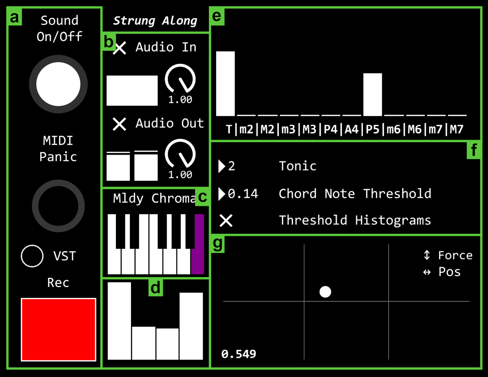

# _Strung Along_

A violin-based interactive music system for real-time chordal accompaniment and timbral control.

Created as my masters thesis for the [Music, Communication, & Technology programme](https://www.uio.no/english/studies/programmes/mct-master/) at the University of Oslo.

Demonstration videos of the system are available on YouTube [here](https://www.youtube.com/playlist?list=PLs6buXDty3Hk-WLUNqRye6r-cFlZ60F5A).

## What is included?

This repository includes the Max patch to run the _Strung Along_. The two sub-systems for chord generation and bow tracking respectively are included as submodules.

In this repo:
- **StrungAlong.maxpat** - the primary Max patch for the system, containing the UI, sound engine, and mapping
- **StrungAlong_string_pad.vital** - the required preset for the Vital software synthesiser
- **requirements.txt** - the Python dependences for the two sub-systems
- **Max_package_requirements** - links for the two required Max packages: MuBu Toolbox and CNMAT Externals
- Submodules:
    - **bow-tracker** - the bow tracking sub-system
    - **chroma-chord-generator** - the real-time chord generation sub-system

## Running instructions

### 1. Install the Python and Max dependencies

Install the Python requirements in your Python environment:

``
pip install -r requirements.txt
``

Install the necessary externals for Max 8:
- MuBu Toolbox for Max
- CNMAT Externals

These externals can be downloaded directly through the Max package manager, or using the links included in `Max_package_requirements.txt` in the root of this repository.

### 2. Install the Vital synth and required preset

Download and install the Vital software synthesiser: [https://vital.audio/](https://vital.audio/)

Add `StrungAlong_string_pad.vital` to your Vital presets in your Documents folder: `/user/Documents/Vital/User/Presets`

### 3. Start the chord generation sub-System

Run the chord generation Python script:

``
python ./chroma-chord-generator/src/main.py
``

### 4. Start the bow tracking sub-system

Start up the bow tracking hardware according to `./bow-tracker/src/main.py`.

Then run the bow tracking Python script:

``
python ./bow-tracker/src/main.py
``

### Open the UI / sound engine

Open `StrungAlong.maxpat' from the root of this repository.

Press the VST button in the Max patch (A in the UI illustration), and load the Vital preset.

Ensure your audio devices are correctly set in Max, and verify that you are seeing live data coming from the bow tracking sub-system in sections D and G of the UI.

Turn on Max DSP, and increase the input and output volume dials section B in the UI. You should see input levels immediately if your microphone is working, while the output section will light up when chords are generated.

Set the tonic (C=0, B=11), chord note threshold (0.12-0.14 work well) in section F.

Also in section F, set the 'Threshold Chroma Histograms' toggle as appropriate. 'Off' can result in some non-diatonic pitches being voiced if the input melody uses non-diatonic pitches. Your mileage may vary - so experiment!

You should see the chroma pitch extracted from the incoming audio in section C, and the generated chroma histograms in section E.